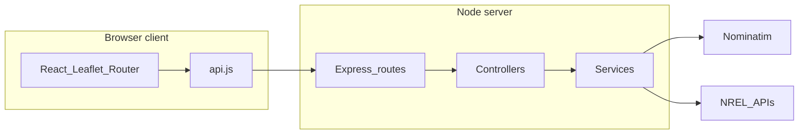

# Solar Site Mapper — Project documentation

This document describes the Solar Site Mapper application in enough detail to verify the assignment requirements: local execution, address-based workflow, mapping, solar resource data, PVWatts estimates, and graceful handling of bad data and API failures.

## Purpose

Solar Site Mapper is a **local** full-stack web application. Users enter U.S. street addresses; the app **geocodes** them via OpenStreetMap **Nominatim**, shows **valid** locations on a **Leaflet** map, and provides a **per-site detail page** that loads **NREL** annual solar resource summaries and a **PVWatts v8** estimate for the resolved coordinates.

The NREL API key stays on the **server**; the browser talks only to the local Express API.

## Prerequisites and local run

- **Node.js** 18 or newer.
- **Dependencies:** from the repo root, `npm run install:all`, or install `server/` and `client/` separately (see [README.md](../README.md)).
- **Root dev command:** `npm install` (for `concurrently`) then `npm run dev` starts the API and the Vite dev server together.
- **URLs:** UI **http://localhost:5173**, API **http://localhost:3000** (override the client base URL with `VITE_API_URL` in `client/.env` if needed).
- **NREL:** copy `server/.env.example` to `server/.env` and set `NREL_API_KEY`. Solar resource and PVWatts routes require a valid key.

External APIs used in production flows are **Nominatim** (HTTPS) and **NREL** (HTTPS); both must be reachable from the machine running the server.

## Assignment objective mapping

| Requirement | How this project satisfies it |
|---------------|-------------------------------|
| Local web app | Runs via `npm run dev`; no cloud deployment required. |
| Map-based landing page | [client/src/pages/MapPage.jsx](../client/src/pages/MapPage.jsx) — map, add form, site list. |
| At least 5 sites | User adds addresses dynamically; supports **five or more** rows (no hard cap). |
| Marker-based visualization | [client/src/components/SiteMap.jsx](../client/src/components/SiteMap.jsx) — one Leaflet marker per **valid** site (resolved lat/lon). |
| Detail page per site | [client/src/pages/SiteDetailPage.jsx](../client/src/pages/SiteDetailPage.jsx) at route `/site/:id`. |
| Address → coordinates | [server/src/services/nominatim.service.js](../server/src/services/nominatim.service.js) via [server/src/controllers/geocode.controller.js](../server/src/controllers/geocode.controller.js) and `GET /api/geocode`. |
| Solar resource per resolved site | NREL Solar Resource Data API v1 — [server/src/services/nrelSolar.service.js](../server/src/services/nrelSolar.service.js), `GET /api/solar`. |
| Basic PVWatts calculation | NREL PVWatts v8 — [server/src/services/nrelPvwatts.service.js](../server/src/services/nrelPvwatts.service.js), `GET /api/pvwatts`. |
| Unresolved / invalid addresses | Site row `status: "invalid"` with `error` message; no map marker; detail page shows the error. |
| Failed API calls | Validation errors return JSON `success: false`; network/timeouts and rate limits return explicit messages (see Error handling below). |

## Workflow: phase 1 vs phase 2

**Phase 1 (current):** The app **ingests addresses dynamically** — no bundled list of five fixed sites. Users add sites from the map page; each row is geocoded, mapped if valid, and detailed pages load NREL data when coordinates exist. This matches the assignment’s “do not start with the final five sites” requirement.

**Phase 2 (update path):** When a final site list is provided, addresses can be preloaded via [client/src/config/initialSites.js](../client/src/config/initialSites.js) and a small client hook to call the existing add/geocode flow, **without** changing API routes or backend contracts (see README Phase 2 note).

## Data model

Each **site** is a plain object in React state (and mirrored to `localStorage`):

| Field | Description |
|-------|-------------|
| `id` | Stable UUID for routing (`/site/:id`). |
| `address` | User-entered address string (trimmed). |
| `lat`, `lon` | Numbers when geocoding succeeded; otherwise `null`. |
| `status` | `"pending"` while geocoding, `"valid"` if coordinates returned, `"invalid"` if not. |
| `error` | Human-readable message when `status === "invalid"` (or transport message); `null` when valid. |

Persistence: [client/src/context/SitesContext.jsx](../client/src/context/SitesContext.jsx) — key `solar-site-mapper-sites`.

## Architecture

The UI does not call NREL or Nominatim directly. The browser uses Axios against the local Express app; the server validates input and calls upstream services.

**Separation of concerns**

- **UI:** React components, routing, Leaflet map, form validation messages — [client/src](../client/src).
- **API layer (client):** Base URL and HTTP helpers — [client/src/services/api.js](../client/src/services/api.js).
- **Backend:** Express app, CORS, JSON body, route mounting — [server/src/app.js](../server/src/app.js).
- **Controllers:** Parse query/body, validate, call services, return JSON — [server/src/controllers](../server/src/controllers).
- **Services:** Nominatim HTTP client; NREL solar and PVWatts HTTP clients with caching — [server/src/services](../server/src/services).

## External APIs

### Nominatim (geocoding)

- **Usage:** Forward geocoding of free-text addresses to lat/lon ([nominatim.service.js](../server/src/services/nominatim.service.js)).
- **Policy:** Requests send a descriptive **User-Agent** identifying the app, per Nominatim’s fair-use expectations.
- **Rate limit:** HTTP **429** is surfaced to the client as **"Geocoding rate limit exceeded"** (not a generic failure).

### NREL

- **Authentication:** `api_key` query parameter from `NREL_API_KEY` in `server/.env` (never exposed to the browser).
- **Solar resource:** `GET` Solar Resource Data v1 with `lat` and `lon` — [nrelSolar.service.js](../server/src/services/nrelSolar.service.js).
- **PVWatts:** `GET` PVWatts v8 with `lat`, `lon`, and fixed demo system parameters — [nrelPvwatts.service.js](../server/src/services/nrelPvwatts.service.js).

## PVWatts parameters (simple estimate)

The assignment asks for a **basic** PVWatts run from resolved coordinates. The server uses **one consistent set** of non-location parameters so results are comparable across sites (emphasis on location, not custom system design):

- `system_capacity`: 4 kW  
- `module_type`: 0 (standard)  
- `losses`: 14%  
- `array_type`: 1 (roof mount)  
- `azimuth`: 180° (south)  
- `tilt`: `min(max(abs(lat), 0), 60)` degrees  
- `dataset`: `nsrdb`  

These are defined in [server/src/services/nrelPvwatts.service.js](../server/src/services/nrelPvwatts.service.js).

## Error and bad-data handling

**Client**

- Empty submit on “Add Site” shows **"Address is required"** without calling the API ([AddSiteForm.jsx](../client/src/components/AddSiteForm.jsx)).
- Duplicate addresses (normalized trim + lowercase) are blocked with **"Address already added"** ([SitesContext.jsx](../client/src/context/SitesContext.jsx)).
- Detail page: unknown `id` shows a short “Site not found” message with a link back to the map.

**Geocoding API** ([geocode.controller.js](../server/src/controllers/geocode.controller.js))

- Missing/blank address → **"Address is required"** ([validation.js](../server/src/utils/validation.js)).
- No Nominatim result → **"Address not found"**.
- Nominatim HTTP 429 → **"Geocoding rate limit exceeded"**.
- Timeout / no HTTP response (typical network failure) → **"Geocoding service unavailable"**.
- Other HTTP errors from Nominatim → **"Geocoding failed"**.

**NREL services** ([nrelSolar.service.js](../server/src/services/nrelSolar.service.js), [nrelPvwatts.service.js](../server/src/services/nrelPvwatts.service.js), [nrelCache.js](../server/src/utils/nrelCache.js))

- On HTTP **429**, the server **waits briefly** and **retries once**. If the second response is still an error, the user sees a clear message (for persistent 429: **"NREL rate limit—try again in a minute"**).
- Successful responses are **cached** (TTL + in-flight deduplication) to avoid duplicate upstream calls (e.g. React Strict Mode double mount).

**Invalid addresses**

If geocoding does not succeed, the site remains in the list with `status: "invalid"` and `error` set; **markers only render for valid coordinates**; the detail page **shows the stored error** for that site.

## Tradeoffs

- **localStorage vs database:** Keeps the demo self-contained and easy to run locally; no migration or DB setup. Not suited for multi-user production use.
- **Backend proxy:** Hides the NREL API key, centralizes validation and error shaping, and avoids CORS issues with third-party APIs from the browser.
- **Server-side NREL cache:** Reduces redundant calls and clarifies behavior under strict client re-renders.

## Updateability

- **Adding or changing sites** during normal use: use the map page (no rebuild beyond saving code).
- **Bulk or scripted list:** Populate `INITIAL_SITE_ADDRESSES` in [initialSites.js](../client/src/config/initialSites.js) and wire a one-time load into the provider when that phase is required, without changing REST routes.

## Code map

| Area | Location |
|------|----------|
| Express entry | [server/src/server.js](../server/src/server.js), [server/src/app.js](../server/src/app.js) |
| Routes | [server/src/routes](../server/src/routes) |
| Geocoding, solar, PVWatts controllers | [server/src/controllers](../server/src/controllers) |
| Nominatim, NREL integrations | [server/src/services](../server/src/services) |
| NREL cache helpers | [server/src/utils/nrelCache.js](../server/src/utils/nrelCache.js) |
| React entry, routes, global styles | [client/src/main.jsx](../client/src/main.jsx), [client/src/App.jsx](../client/src/App.jsx), [client/src/index.css](../client/src/index.css) |
| Site state | [client/src/context/SitesContext.jsx](../client/src/context/SitesContext.jsx) |
| Map, list, form | [client/src/components](../client/src/components) |
| Map page, detail page | [client/src/pages](../client/src/pages) |

## How to test

1. Enter at least 5 valid U.S. addresses.
2. Click **Add Site**.
3. Markers will appear on the map.
4. Click any marker to view solar resource and PVWatts data.

**Note:** The application dynamically ingests addresses (no preloaded data), as required by the assignment.

After starting the stack (`npm run dev`: API **http://localhost:3000**, UI **http://localhost:5173**), follow the steps above.
