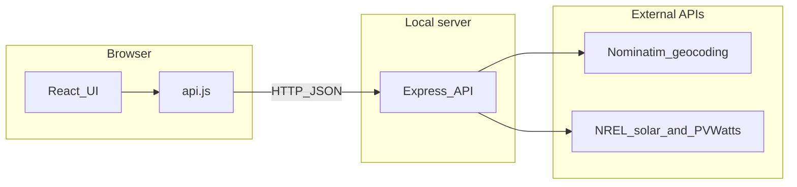
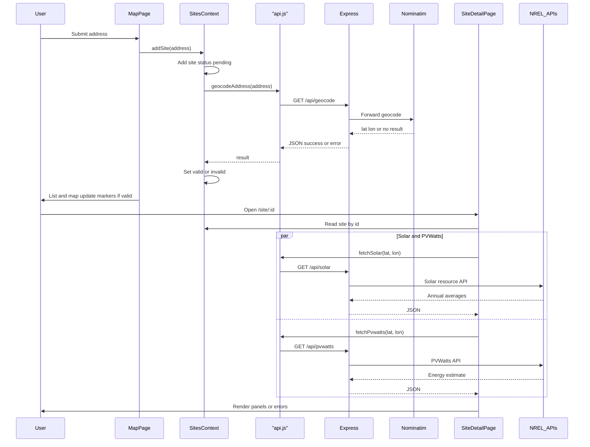
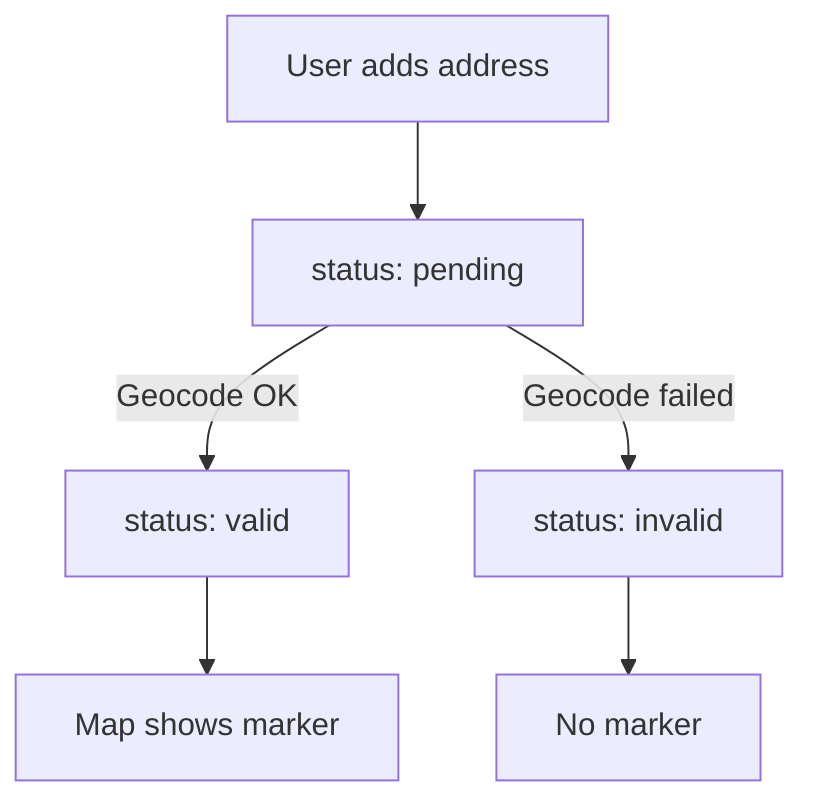

# Solar Site Mapper

This note explains the project in plain language. Use it to learn the system and to talk about it in interviews.

---

## 1) Simple overview

### What problem it solves

People comparing **solar potential** at different **addresses** need two things: **where** each address is on a map (latitude and longitude), and **how sunny** that spot is (resource data and a simple energy estimate). This app lets you add U.S. addresses, see valid locations on a map, and open each location’s **detail page** with solar numbers from public APIs.

### What happens when a user enters an address

1. The app adds a **new row** for that address and marks it **pending** while it looks up coordinates.
2. The **backend** asks **Nominatim** (OpenStreetMap) to turn the text address into **lat/lon**.
3. If that works, the row becomes **valid** and a **map marker** appears. If not, the row is **invalid** and an **error message** is stored.
4. On the **detail page** (`/site/:id`), if the site is valid, the app loads **NREL** data: annual solar resource (DNI/GHI-style summaries) and a **PVWatts** estimate for a small fixed “demo” solar setup.

---

## 2) System flow (step-by-step)

**User → frontend → backend → external APIs → back to UI**

1. **User** types an address on the map page and submits.
2. **Frontend** (`AddSiteForm` → `SitesContext.addSite`) adds or updates a **site** in memory and may call **`api.js`**.
3. **`api.js`** sends `GET /api/geocode?address=...` to your **Express** server (not to Nominatim directly from the browser).
4. **Backend** validates the address, calls the **Nominatim** service, returns JSON (`success` + `data` or `error`).
5. **Frontend** updates the site to **valid** (lat/lon) or **invalid** (error). The **map** shows markers only for valid sites.
6. **User** opens **Site detail** for a valid site.
7. **Frontend** calls `GET /api/solar` and `GET /api/pvwatts` with lat/lon.
8. **Backend** checks the **NREL API key**, calls NREL, may use **cache**, returns JSON.
9. **UI** shows loading states, then numbers or error messages.

---

## 3) Mermaid diagrams

### A. High-level architecture (flowchart)

Shows: Browser/React → Express API → Nominatim + NREL.

### B. End-to-end sequence (sequenceDiagram)

Add address → geocode → map → open detail → solar + PVWatts.

### C. State lifecycle (flowchart)

`pending` → `valid` / `invalid` → markers only for `valid`.

---

## 4) Layer explanation

### Frontend (what and why)

| Piece | What it does | Why it exists |
|--------|----------------|----------------|
| **`SitesContext.jsx`** | Holds the list of **sites**, runs **add site** (geocode), syncs to **localStorage**, blocks **duplicate** addresses | One place for shared state so the map, list, and detail page stay in sync |
| **`MapPage.jsx`** | Landing page: form, map, list of sites | Main screen for adding addresses and seeing all sites |
| **`SiteDetailPage.jsx`** | Shows one site by **id** from the URL; loads **solar** and **PVWatts** when coordinates exist | Focused view for NREL data per location |
| **`api.js`** | Axios client with **base URL**, helpers: `geocodeAddress`, `fetchSolar`, `fetchPvwatts` | Keeps HTTP details out of components; easy to change the server URL |

Supporting pieces (good to mention briefly): **`AddSiteForm`** (empty-input check), **`SiteMap`** / **`SiteList`** (UI), **`App.jsx`** (routes + provider).

### Backend (what and why)

| Layer | What it does | Why it exists |
|--------|----------------|----------------|
| **Routes** | Map URLs like `GET /api/geocode` to controller functions | Keeps URL wiring separate from business logic |
| **Controllers** | Read **query params**, call **validation**, call **services**, return **JSON** | Thin HTTP layer: translate request → service → response |
| **Services** | Talk to **Nominatim** and **NREL** (HTTP), apply **retries** for some errors, use **cache** for NREL | External APIs change; isolating them makes testing and updates easier |
| **Validation** (`validation.js`) | **`parseAddress`**, **`parseLatLon`** | Fail fast with clear errors instead of confusing upstream API errors |

---

## 5) Data model

Each **site** is a plain JavaScript object (in React state, mirrored to localStorage).

| Field | Meaning |
|--------|---------|
| **`id`** | Unique id (UUID) for routing to `/site/:id` |
| **`address`** | The text the user entered (trimmed); shown in the list and detail page |
| **`lat`**, **`lon`** | Numbers when geocoding succeeded; **`null`** if invalid or still resolving |
| **`status`** | **`pending`**: geocode in progress · **`valid`**: has coordinates · **`invalid`**: could not resolve or request failed |
| **`error`** | Human-readable message when **`invalid`**; **`null`** when things are ok |

---

## 6) API usage

### Nominatim → geocoding

- **Role:** Turn a **free-text address** into **latitude/longitude**.
- **Called from:** Server (`nominatim.service.js`), triggered by **`GET /api/geocode`**.

### NREL → solar resource + PVWatts

- **Solar resource API:** Annual summaries (e.g. average DNI/GHI-style fields used by the UI).
- **PVWatts API:** A **standardized** small system (fixed kW, losses, tilt rule, etc.) so numbers are **comparable across sites**, not a full custom PV design tool.
- **Called from:** Server services, via **`GET /api/solar`** and **`GET /api/pvwatts`**.

### Why a backend proxy (not calling NREL from the browser)

- **API key protection:** The NREL key lives in **server environment variables**, not in client code.
- **Validation:** Coordinates and addresses are checked **before** calling paid or rate-limited APIs.
- **Stable contract:** The UI talks to **your** API; you can change providers or errors without rewriting every component.
- **CORS / security:** Browser calls go to your server; the server calls third parties.

---

## 7) Error handling

| Situation | What happens | How the UI sees it |
|-----------|----------------|---------------------|
| **Empty input** | Form validation; no geocode request | **"Address is required"** on the form |
| **Invalid / not found address** | Nominatim returns no usable result | Site **`invalid`**, message like **"Address not found"** |
| **Rate limit (429)** — geocode | Server maps Nominatim 429 to a clear message | JSON error **"Geocoding rate limit exceeded"**; site can be **`invalid`** with that text |
| **Rate limit (429)** — NREL | Server may **wait and retry once**; if still bad, clear message | Error text like **"NREL rate limit—try again in a minute"** on the detail panels |
| **Network / API failure** | Geocode: timeout or no response handled in controller; client also catches fetch errors | Messages such as **"Geocoding service unavailable"** or **"Could not reach the geocoding service…"** |
| **Missing NREL key on server** | Controllers check `NREL_API_KEY` | **"Server is missing a valid NREL_API_KEY in .env"** |

Detail page also **aborts** in-flight requests when you navigate away (so Strict Mode or fast navigation does not leave stale updates).

---

## 8) Design decisions

| Decision | Why |
|----------|-----|
| **No preloaded sites** | Sites are added **live** by the user (`INITIAL_SITE_ADDRESSES` is empty in config). Keeps the demo dynamic and matches “user-driven” workflows. |
| **localStorage** | Survives **refresh** without a database; fine for a local demo. Not for multi-user production. |
| **Caching (NREL)** | Same lat/lon should not hammer NREL on every revisit; **TTL cache** plus **in-flight deduplication** help. |
| **Separation of concerns** | UI in React, HTTP helpers in `api.js`, rules and secrets on the server, external calls in **services**. Easier to test and explain in interviews. |

---

## 9) Performance

- **Server-side NREL cache:** Successful responses are stored for a **time window**; keys use **rounded coordinates** so tiny float differences do not explode the cache.
- **In-flight dedupe:** If two requests ask for the **same** NREL key at the **same** time, only **one** upstream call runs; others await the same promise.
- **Client:** Duplicate **addresses** are blocked before calling geocode; detail page uses **AbortController** to cancel duplicate solar/PVWatts calls when the effect re-runs or the user leaves.

---

## 10) Summary 

You can see it something like this:

> “Solar Site Mapper is a small full-stack app for comparing solar potential at different U.S. addresses. The user adds an address on a map page; we geocode it on the server with Nominatim, store each site in React state and localStorage, and show valid locations on a Leaflet map. Opening a site’s detail page loads NREL solar resource data and a PVWatts estimate for that lat/lon—the NREL API key never goes to the browser; the Express backend proxies those calls and validates input. We handle bad addresses, rate limits, and network errors with clear messages, and we cache NREL responses to avoid repeat calls. The architecture is intentionally layered: React UI, a thin API client, Express controllers and services, and external APIs.”

---

## Related doc

For more details and file paths, see [PROJECT_DOCUMENTATION.md](./PROJECT_DOCUMENTATION.md).
